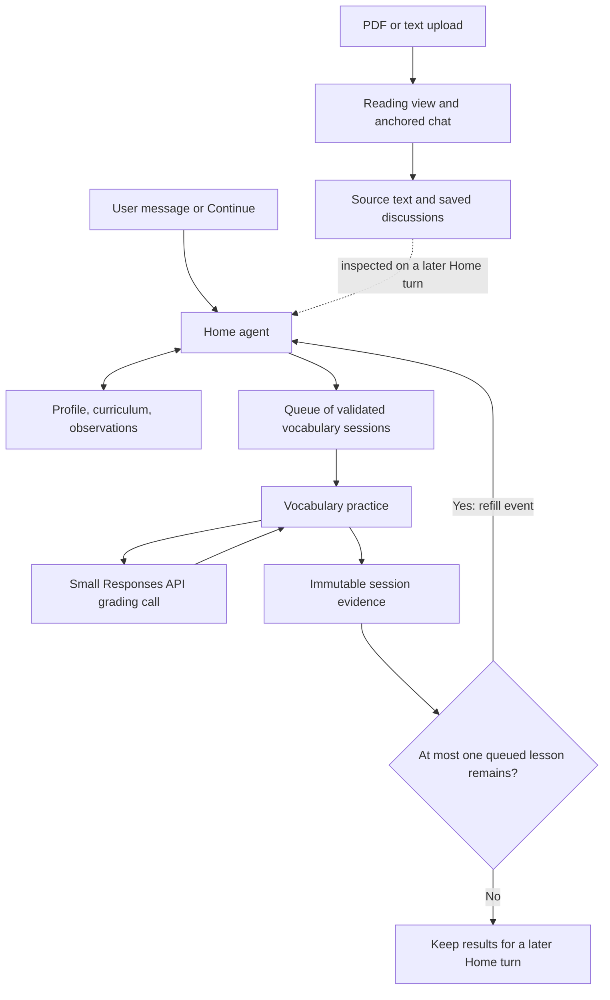

# Wordfield: Home, shared documents, and practice modules

Status: direction approved; updated with repository confinement, separate delivery tracks, and automatic lesson-queue replenishment. No application changes in this planning pass.

## 1. Proposed direction

Home owns the learner's goals, curriculum, and interpretation of evidence over time. Practice modules execute a bounded activity and preserve what happened. The Home agent runs on user messages/Continue and on a vocabulary queue refill event. There is no heartbeat or periodic polling trigger.

This is a useful separation because correctness and educational value are different questions. A vocabulary grader can decide whether an answer captures a phrase's meaning. Home decides whether practicing that phrase advances the user's goals, whether the evidence warrants changing the curriculum, and what to try next.

For example, a learner who wants to make everyday plans in Spanish might practice interpreting conditional invitations. Another learner preparing to read academic articles might need the same word in a different context and with different feedback. Each prepared session should therefore carry its learning objective and relevant constraints, as well as its questions.

Give Home autonomy over educational decisions and document organization within its workspace. Keep evidence preservation, file ownership, input validation, and session lifecycle in application code. Do not introduce a fixed pedagogical taxonomy, mastery database, scheduled runs, or elaborate agent hierarchy in this iteration.



The arrows primarily represent document reads and writes. After vocabulary results are saved, application code checks the queue and may enqueue one Home refill run. Reading activity does not trigger Home automatically. This bounded application event is the explicit exception to the earlier manual-only lifecycle; it does not require a plugin-to-agent messaging system.

## 2. Decisions to review

The user confirmed both key vocabulary choices during planning: Restart replays the same prepared set, and saved sessions retain answers, feedback, and an overview. The user also approved a future-lesson queue with a target of five, a low-water trigger of one, repository-confined document tools, and separate reader delivery. Operational defaults below preserve the intentional freedom in educational decisions.

| Decision                                         | Proposed default                                                                                                  | Consequence                                                                                                                |
| ------------------------------------------------ | ----------------------------------------------------------------------------------------------------------------- | -------------------------------------------------------------------------------------------------------------------------- |
| Restart with a prepared question set — confirmed | Discard current answers and replay the same frozen ten questions.                                                 | Immediate restart. A different set requires a Home turn. This changes the old behavior, which generated fresh questions.   |
| Evidence retained after a saved quiz — confirmed | Preserve questions, answers, feedback, attempts, skips, assistance flags, and a short factual overview.           | Home can reconsider a grading mistake instead of relying on a lossy summary. Discarded attempts are excluded.              |
| Home autonomy                                    | Update profile/curriculum and observations during a user-triggered or queue-refill run without per-edit approval. | The UI shows resulting document changes. The user can correct the agent through chat.                                      |
| Reading input formats                            | Born-digital PDF and UTF-8 TXT/Markdown. Initially limit uploads to 25 MB and 200 PDF pages.                      | No OCR, EPUB, DOCX, or faithful page-layout reconstruction in this pass. Limits are implementation defaults we can adjust. |
| Reading persistence                              | Save chat messages as they occur, with stable anchors and the context used for each response.                     | Reader discussions survive navigation and server restarts; reader activity does not itself trigger Home.                   |
| Reading assistant                                | Include the document-grounded assistant requested for the reader.                                                 | Confirmed: include the reader assistant; general autonomous plugin planners remain deferred. Deliver reading separately.   |
| Data scope                                       | Continue with one learner and one local Node process.                                                             | Actual files remain sufficient; no authentication, database, sync, or multi-process coordination yet.                      |
| Existing learner data                            | Preserve and migrate the existing learner description and saved logs.                                             | Historical summaries remain summaries; never reconstruct answers that were not stored.                                     |
| Model choices                                    | Configure Home, vocabulary grading, and reader independently. Start grading experiments with Luna at `none`.      | No assumption that a model name alone guarantees the fastest acceptable result.                                            |

The user's concrete learning goals do not need to be decided during development. Home should establish them conversationally. A missing goal is an explicit unknown, not permission to invent a biography or silently choose a long-term objective. The unfinished curriculum sentence in the proposal is interpreted as a free-form plan for progressing toward these goals.

## 3. Latency: remove work from the practice path

### What the current implementation does

`lib/tutor.ts` makes a separate model call to generate each next question, assess each answer, and summarize a finished session. Every call uses `gpt-6-luna` with reasoning effort `low`. Assessment includes the full composed learner description and saved logs. The UI waits for the complete structured response before showing feedback.

There is also an assessment leak in the current UI: `question.focus` can contain the very interpretation being tested, and is displayed above the question. The screenshot illustrates this. Future plans should separate a short, non-answer-revealing display label from the private teaching objective and rubric.

The `« … »` marks in that screenshot are quotation marks, commonly used in Spanish. They have no special application meaning. We can consistently request ordinary curly quotes for presentation if desired; that is independent of grading.

### Proposed request pattern

| Activity                               | Model work                                                                      | When the learner waits                                                                 |
| -------------------------------------- | ------------------------------------------------------------------------------- | -------------------------------------------------------------------------------------- |
| Prepare vocabulary sessions            | Home prepares question sets ahead of time, initially filling the queue to five. | During initial Home planning; subsequent refill runs proceed outside the quiz request. |
| Start / next question / skip / restart | None.                                                                           | Local UI and storage only.                                                             |
| Check an answer                        | One compact structured Responses API request.                                   | Only while the answer is evaluated.                                                    |
| Finish a vocabulary session            | Save the evidence document and deterministic overview. No model summary.        | Local disk commit only.                                                                |
| Interpret results / adjust curriculum  | Home reads saved evidence on an explicit turn or queue-refill run.              | Explicit chat streams progress; automatic refill does not block practice.              |
| Ask about a reading passage            | One reader run, with tools only when additional text is needed.                 | In reader chat, with streaming.                                                        |

Preparing a complete set in one ordinary request is not the OpenAI Batch API. We do not need an asynchronous batch-processing service for this flow.

Luna is documented as an efficient model for focused, high-volume tasks and supports `reasoning.effort: "none"`. That supports trying a cheaper reasoning setting for this bounded grading task; it does not establish that Luna wins every latency comparison. Keep Luna as the baseline, measure `none` versus the current `low`, and only change the default if grading quality remains acceptable. [GPT-6 Luna documentation](https://developers.openai.com/api/docs/models/gpt-6-luna).

If we need a second model comparison, GPT-4.1 mini is documented as having low latency without a reasoning step. Treat it as an experimental control, subject to account availability, rather than promising it will outperform Luna. [GPT-4.1 mini documentation](https://developers.openai.com/api/docs/models/gpt-4.1-mini).

The proposed architectural changes follow the documented latency strategies of doing fewer sequential requests, producing shorter outputs, and precomputing predictable work. We should measure the result rather than promise instantaneous LLM grading. [OpenAI latency guidance](https://developers.openai.com/api/docs/guides/latency-optimization).

The grader receives only the frozen question/rubric, the session's relevant objective and language constraints, the current answer, and retries for that question. It does not receive the whole curriculum, every prior session, or filesystem tools. Return the existing three verdicts with brief feedback, a short evidence note, and separate language/constraint notes. Keep longer interpretation in Home.

Initial role settings: keep `gpt-6-luna` with `low` reasoning for Home; trial Luna with `none` for vocabulary grading; start the reader with Luna at `low` and streamed replies. Make these three model/effort pairs independently configurable on the server. Benchmark grading before adopting its new default. No paid priority service tier is needed for the initial experiment.

The SDK is not itself the main problem demonstrated by the current design: these are already single-turn calls. Use direct Responses API calls for grading because that is a simpler fit. Retain the Agents SDK for Home and the reader's tool use; it supports application-owned tools and state. [Agents SDK documentation](https://developers.openai.com/api/docs/guides/agents/sdk).

## 4. Shared workspace on the local filesystem

Use a literal, gitignored directory under `.local/workspace/`. Markdown holds evolving human-readable documents; JSON holds documents that plugins must validate or reproduce exactly. This is still document storage, not a relational performance database.

```text
.local/workspace/
  INDEX.md                              # Generated map of documents and conventions
  home/
    profile.md                          # Mutable learner facts, goals, constraints, brief skills overview
    curriculum.md                       # Mutable free-form educational plan
    observations/
      performance/                      # Core category; Home decides when to write
      <agent-created-category>/         # Strategies, interests, curriculum changes, etc.
    conversations/<conversation-id>/    # User and Home messages, managed by the app
  plugins/
    vocabulary/
      drafts/<draft-id>.json            # Home-authored plans, validated before publication
      plans/<plan-id>.json              # Immutable published question set
      sessions/<session-id>/
        evidence.json                   # Immutable saved observations
        overview.md                     # Factual rendering with links to evidence and plan
      legacy/<old-log-id>.md             # Imported historical summaries
    reading/
      documents/<document-id>/
        source.pdf                      # Or source.txt / source.md; original bytes
        metadata.json                   # Title, source URL where applicable, extraction version
        pages/<page-id>.json             # Frozen canonical text and stable blocks
        threads/<thread-id>/
          anchor.json                   # Document version + page/block/range
          messages/<message-id>.json     # Immutable message records
      sessions/<reading-session-id>.json # Explicitly ended reading activity, not a mastery score
  _system/
    manifest.json                       # Document IDs, hashes, types, ownership, write rules
    revisions/                         # Prior document versions for diffs and recovery
    changes/                           # Ordered application-generated change records
    cursors/                           # Per-consumer acknowledged diff positions
    plugin-state.json                   # Ordered queue + active/completed/superseded plan references
    jobs/                              # Durable, deduplicated Home refill events
    config.json                        # Queue target 5, low-water mark 1, run limits
    runs/                              # Local request, tool, context, and timing records
    drafts/                            # Unfinished activity; excluded from educational diff
```

Paths are proposed conventions, not a requirement for an agent to memorize opaque IDs. `INDEX.md` and listing tools expose titles, paths, types, dates, and short descriptions. Home can create nested observation categories freely and link to the documents it used. Do not force a new observation log after every session: tool availability and the reason to record observations belong in the agent instructions, while timing and categorization remain discretionary.

A small document service is the only application component that writes this workspace. It handles atomic replacement, serialized mutations, document versions, and crash recovery. The content file, revision record, and change index form one recoverable write operation: use a small write-ahead record and reconcile incomplete writes on startup. Avoid a design where a crash can save new evidence but permanently omit it from diff. Agent document tools are confined to the dedicated workspace within the repository, as detailed below. No arbitrary shell access or access to `.env.local` is needed for document autonomy.

Actual files are inspectable outside the app. If we support manual edits, detect content-hash changes on startup and before a diff, register a new revision, and label the author as external. Do not silently overwrite an external edit based on a stale agent read. Operational metadata and completed evidence should be treated as application-managed files; this MVP is not a tamper-proof filesystem.

### Repository and workspace confinement

The fixed canonical repository root is the outer boundary; `.local/workspace/` is the narrower document-tool root. Tools do not receive a user- or model-selectable root. This satisfies repository-only access while keeping source code, `.git`, dependencies, and credentials outside the agent's document surface.

All tools share one path-resolution and authorization layer, including reads, writes, listing, search, diff/revision access, directory creation, publication, and any later move/rename operations:

- Accept workspace-relative paths or server-resolved document IDs. Reject absolute paths, traversal, unsupported path forms, and prefix lookalikes such as `workspace-other`.
- Verify canonical root containment with path components, not a string prefix. Validate the workspace root itself and every existing parent when creating a new file or directory. A symlinked workspace must not point outside the repository.
- Reject symlink path components and symlink traversal during recursive search/listing. Use no-follow file operations and recheck boundaries around mutations; do not rely solely on a one-time check followed by an unrestricted open. Reads and writes must share these protections.
- Apply per-document ownership and immutability rules after path validation. A legal location does not imply permission to overwrite its content or metadata.
- Uploaded reader files are copied through the import endpoint into server-chosen paths inside the workspace. The document agent never reads an arbitrary original path on the user's computer. External sample downloads similarly enter through the importer, not an unrestricted filesystem tool.

Tests must exercise traversal, absolute paths, symlinked roots/parents/files, recursive-search escapes, new-file writes through a linked parent, and rename destinations. This boundary applies equally to Home and the reader, with the reader's additional namespace restrictions.

### Document ownership is explicit

| Document                              | Home agent                                       | Plugin/helper   | Application                                         |
| ------------------------------------- | ------------------------------------------------ | --------------- | --------------------------------------------------- |
| Profile / curriculum                  | Read and revise                                  | Read            | Version writes and expose them in UI                |
| Home observations                     | Create; revise mutable notes; append/create logs | Read            | Enforce each document's write policy                |
| Vocabulary draft                      | Create and revise                                | Validate/read   | Publish only a complete valid plan                  |
| Published plan                        | Read                                             | Read            | Freeze and track its session lifecycle              |
| Saved vocabulary evidence             | Read                                             | Read            | Create once; later corrections are separate records |
| Reading source / canonical extraction | Read                                             | Read            | Import and freeze per document version              |
| Reading conversations                 | Read                                             | Read            | Append authenticated user/model message records     |
| Operational metadata and traces       | No agent writes                                  | No agent writes | Maintain                                            |

Write policies are server-controlled metadata. An agent cannot unlock an immutable file by changing a field in that file. Agent-created observations can be mutable notes or append-only logs, but an established policy cannot be weakened through ordinary content edits. Corrections reference the original evidence instead of erasing it.

## 5. Home agent and its tools

One Home conversation and one active Home run are sufficient initially. At the beginning of a turn provide the profile, curriculum, workspace map, plugin descriptions and input schemas, a bounded recent conversation history, and a count of unreviewed changes. The agent chooses additional reads. Permission to access a document does not mean every document belongs in every model request.

Proposed tools:

- `list_documents(path, cursor)` and `read_document(path, revision?, section?)`.
- `search_documents(query, path?)` for occasional targeted lookup, without embeddings.
- `create_directory(path)` and `write_document(path, content, expectedRevision?)`.
- `publish_document(path, expectedRevision)` to validate and freeze a typed plugin input through the plugin's registered schema.
- `diff(cursor?, pageToken?)` to inspect added, changed, or removed documents.

Publishing is a document-store operation. It does not call a plugin agent, initiate practice, or introduce a message bus. A publish failure returns field-specific validation errors so Home can repair the draft. No ready session is advertised until publication succeeds.

The agent runs on explicit user input or a recorded low-queue event; an individual run may take multiple tool steps. Serialize Home runs, impose a configurable tool-step and time budget, and support Cancel. Successful document writes remain versioned if a later step fails; the turn should report partial completion rather than pretend that all writes were rolled back. Retrying a run must not duplicate published plans or observation documents.

Home can organize files inside its writable categories; a bounded move/rename operation may be added with the document store. Stable document IDs preserve references when paths change. Runtime-generated indexes stay authoritative, rather than requiring the agent to manually synchronize a second inventory.

### Diff semantics

A filesystem timestamp is not enough to define “since last time.” Use an ordered sequence of document changes and a persisted cursor for each consumer.

1. A diff returns a bounded change range, paths, document IDs, authors, old/new versions, and text patches or links to exact versions. Large outputs are paginated or explicitly truncated.
2. During a run, later diff calls can continue after the last delivered range. Merely listing a document does not mean the agent has understood it; it must read the evidence it intends to use.
3. Persist the acknowledged cursor only after the enclosing Home turn completes successfully. If the turn fails or is cancelled after seeing the changes, offer them again on the next turn. This slightly strengthens “since the last diff” to avoid silently losing work.
4. Files written after the diff's upper bound remain available for the next diff. Do not advance past unseen pages.
5. Track authors so Home can distinguish its own edits from new practice evidence. Exclude operational traces, temporary drafts, and cursor updates from the educational change stream.

Changes are durable. Home inspects them on explicit turns and on queue-refill runs, using the same logical consumer cursor so both see what remains unreviewed. Finishing a quiz can trigger a refill after its evidence is durably saved. A “Discuss this practice” action still opens Home with a draft user message; sending it starts a user turn. An automatically produced message is labeled as an automatic run, not presented as something the user said.

### Educational behavior

Profile facts should distinguish user statements from agent hypotheses. A brief skills section can summarize observed capabilities and link to evidence; it should not become a hidden mastery table. Curriculum goals remain prose, with stable references when sessions need to cite them. Home may propose experiments and revise its working plan, but cannot infer that one good answer proves fluency or that one preferred exercise establishes a fixed learning style.

A practice outcome is always interpreted relative to what was asked, what assistance was shown, and the goal being practiced. Reader scrolling and highlighting show activity, not comprehension. Reader explanations are things the assistant taught, not abilities the learner demonstrated.

## 6. Vocabulary plugin contract and lifecycle

Publish an ordered queue of ready plans. The configurable target is `lessonQueueTarget = 5`; the configurable low-water mark is `lessonQueueLowWater = 1`. Count only unstarted, valid plans: exclude drafts, the active session, completed lessons, and superseded plans. Target means five ready lessons in total, not five new lessons per run. Validate that the target is greater than the nonnegative low-water mark. An empty queue produces a clear error/refill status with a route back to Home. The plugin must never silently generate questions itself.

The input document needs a small stable contract:

| Field                     | Purpose                                                                                                    |
| ------------------------- | ---------------------------------------------------------------------------------------------------------- |
| `schemaVersion`, `planId` | Validation and identity                                                                                    |
| `sourceDocuments`         | Exact profile/curriculum paths, revisions, and hashes used for planning                                    |
| `objective`               | Goal reference plus a plain-language description of what this session practices                            |
| `constraints`             | Language pair, permitted answer languages, requested answer depth, relevant preferences                    |
| `questions[10]`           | Stable IDs, safe display labels, complete prompts, private rubrics, accepted alternatives, example answers |

The objective and constraints are frozen with the plan. A profile edit during a quiz affects a future session, not the meaning of the current answer. Home may supersede, replace, or reorder unstarted plans when new goals or evidence justify it, but cannot rewrite an active plan or its rubric. A replacement is a new immutable plan with a link to the superseded one; the queue references change, not the old document.

On start, atomically claim the first ready plan, remove it from the unstarted queue, and create an active session. Starting a session does not wait for replenishment. Keep question advancement, three-attempt limits, skips, request IDs, and stale-response rejection in application code. Send only the current question to the ordinary learner view; keep answers and rubrics behind developer inspection.

For Restart, the confirmed behavior is a new attempt on the active plan: cancel in-flight grading, discard the active draft, reset to question one, and retain no evidence-based log for the abandoned attempt. Record that the plan has been replayed, without keeping the discarded answers, so a later saved session is not misleadingly described as first exposure. A subsequent late model response must not save an answer, update progress, or write evidence.

Finish, or explicit End early, saves a factual evidence document exactly once. Include the actual presented question, question/rubric version, answer attempts, verdicts, feedback, skips, hint/retry exposure, whether developer answers were revealed, and the objective/constraint snapshot. Do not penalize unanswered questions in an early-ended session. An entirely untouched session can end without creating a performance record. A provider failure is not an incorrect answer and does not use an attempt.

After completion, the next queued plan is available immediately. If no valid queued plan exists, show that state rather than reuse a completed plan. Returning to Home does not itself create a new plan. Restart is available while an attempt is active; deliberate practice of an already completed plan can be added later as a separately labeled review activity.

Home can question a saved grader verdict by creating a linked interpretation/correction document; it should not alter the original transcript or rewrite the assessment the user actually received.

### Queue replenishment lifecycle

The proposed trigger point is **after a vocabulary session is saved**, when at most one unstarted lesson remains. This lets Home use the most recent completed lesson while the remaining queued lesson provides a buffer. For example: start with five, finish four, refill the remaining one back to five. An explicit early end also closes a lesson; if it has no answers, it contributes no performance evidence. Restart reuses the active plan, does not consume another queued plan, and does not trigger a refill.

1. Commit the saved evidence (when present), closed-session state, and a deduplicated refill event if the queue is low. Return the quiz completion response without waiting for Home.
2. A local application worker runs the event while the server is running. Serialize it with manual Home runs and coalesce additional low-queue events into the pending/running refill. Persist pending work for recovery after a server restart; do not create a heartbeat, cron job, or loop that wakes Home simply because time has passed.
3. Home calls diff and reads newly completed evidence, then reviews the profile, curriculum, and remaining plans. Queued/unplayed lessons have no performance results and must never be treated as evidence. It may revise its educational plan and replace an unsuitable unstarted lesson.
4. Publish only enough validated plans to restore the configured target, using the current queue state at publication. Queue mutations are versioned and serialized so a concurrent lesson start or manual planning turn cannot claim the same plan twice or overfill the queue through duplicate publication. Idempotency keys prevent re-publishing plans on retries.
5. If the run fails or is cancelled, preserve existing ready lessons and any successfully published plans. Surface the incomplete refill in Home/developer view with Retry; no tight automatic retry loop. A later explicit turn or new session-completion event can re-evaluate the need for refill. Cancel suppresses retries of that same event.

Initial queue creation happens in a Home conversation after the user's goals are sufficiently clear. A low queue cannot manufacture missing learner goals: if a refill needs clarification, it pauses for user input. Manual goal changes can cause Home to replace queued lessons during that turn. Record the reasons for changes; always preserve the active lesson and completed evidence.

This introduces event-driven automatic curriculum review, explicitly replacing the earlier manual-only rule for this one trigger. Queue depth and the refill threshold are experimental hyperparameters; five and one are starting values, not a claim about optimal learning. Deeper queues trade more advance preparation for slower incorporation of new evidence, which is why Home can revise unstarted lessons.

## 7. Reading plugin

### Import and viewing

Use Mozilla PDF.js (`pdfjs-dist`) to extract page text. Its official Node example demonstrates per-page `getTextContent()` extraction. Render our own page-labeled HTML text view so text selection, paragraph anchors, responsive reflow, and adjacent discussions use normal browser behavior. PDF.js also supplies a full viewer if preserving original visual layout becomes important later. [PDF.js overview](https://mozilla.github.io/pdf.js/getting_started/), [official text extraction example](https://github.com/mozilla/pdf.js/blob/master/examples/node/getinfo.mjs).

A custom text viewer is the simpler fit for this experiment, but extraction is not equivalent to understanding layout. Even readable PDFs can have unusual reading order, repeated headers, or broken hyphenation. Normalize once, inspect the seed documents, preserve source page boundaries, and freeze that extraction version. Do not let a model silently rewrite the source text. Show an explicit import error for unsupported/empty extraction; OCR remains out of scope.

TXT and Markdown use the same canonical block model with app-defined sections instead of original PDF page numbers. Imported Markdown is text content, not executable HTML.

Candidate Spanish PDF seeds are Horacio Quiroga stories published by Argentina's Biblioteca Nacional, including [La tortuga gigante](https://www.bn.gov.ar/micrositios/admin_assets/issues/files/6a05ce930729e80b879994e05dab3daa.pdf) and [a second Quiroga booklet](https://www.bn.gov.ar/micrositios/admin_assets/issues/files/25e370cf0ba517419b14c5e3877b0fc9.pdf). These are candidates, not installed fixtures: the web fetch exceeded the research tool's size limit, so extraction quality must be verified during the reading commit. Keep title, author, source URL, and edition/reuse information with every seed. Download into the local workspace; do not assume a historical author's text makes a modern illustrated edition freely redistributable in the repository.

### Viewport and selection context

At Send, snapshot the currently visible source pages, selected passage if any, active thread anchor, and document version. Resolve that context against the stored canonical text on the server. Supply actual page text to the model, not just page numbers. Moving the viewport after Send must not change the context of the in-flight response.

The reader has `read_document_pages(documentId, pageRange)` and targeted text search tools for obtaining more context. It can read Home documents and its own plugin documents as needed, but cannot edit Home or reinterpret the curriculum autonomously. A long document is available through tools without being sent in full on every message. For unusually large visible pages, record any context truncation explicitly and retain a tool path to the omitted text.

“Pages in the viewport” refers to source-page containers in the reflowed reader. It is not based on incidental screenfuls that change when a user resizes the window.

### Persistent discussions

Highlighting text and asking about it creates a thread anchored to:

- document ID and extraction version;
- page/block IDs and canonical character offsets;
- exact quoted text, with neighboring text as a recovery aid.

Do not store a pixel position or CSS selector as the durable location. Multi-paragraph selections should preserve their component ranges. A gutter control beside a paragraph creates an anchor without a selection. That control must also be accessible by keyboard and touch, rather than requiring hover.

Clicking the comment bubble restores the associated thread in the side panel and scrolls to the passage. Document-level chat is also possible and has an explicit document-level anchor. Each message retains its actual context snapshot, including later viewport changes within the same discussion. A replacement or new extraction creates a new version; old discussions stay attached to their original text until deliberately reanchored.

Messages are saved as they happen. An explicit End reading action can write a factual activity document linking the text and discussions, without running Home or inventing a proficiency assessment. Incomplete reading activity can remain incomplete; no heartbeat is required to close it automatically.

## 8. Extensibility and application structure

“Plugin” here means a built-in Wordfield module registered in code, not an external marketplace or dynamically executed third-party bundle.

Keep the existing Next.js, TypeScript, React, Zod, and shadcn-style components. Add the direct OpenAI SDK as an explicit dependency for Responses calls and PDF.js for extraction. No database, vector index, queue service, or hosted file-search store is required.

Proposed code boundaries:

```text
app/
  page.tsx                         # Home
  vocabulary/page.tsx
  reading/page.tsx
  reading/[documentId]/page.tsx
  api/home/...                     # Explicit chat/run endpoints
  api/documents/...                # Scoped document inspection
  api/plugins/vocabulary/...
  api/plugins/reading/...
lib/
  workspace/                       # Files, revisions, policies, diff, index
  home/                            # Agent instructions, tools, context, conversation
  models/                          # Role-specific configuration and request telemetry
  plugins/
    registry.ts
    vocabulary/                    # Input/evidence schemas, state machine, grader
    reading/                       # Import, extraction, anchors, threads, reader agent
components/
  home/
  vocabulary/
  reading/
  developer/
```

Each plugin registers its ID, title, route, workspace directory, supported input document types, validators, output document types, and ownership policies. A plugin is allowed to have no Home-generated input: reading takes a user-supplied file and needs no planned lesson document. The registry exposes capabilities and schemas to Home without hard-coding vocabulary-specific logic into the core document service.

Access follows the proposed superset model: Home can inspect shared Home documents and every plugin's documents; a plugin helper can inspect shared Home documents plus its own namespace. The bounded vocabulary grader deliberately receives less context and no tools. That is a request-size choice, not a separate ownership model.

## 9. Home UI and developer view

Home shows the current goals/curriculum, chat, available practice modules, the number and order of ready vocabulary lessons, refill status, and whether new practice documents await review. The current seed editor becomes the editable profile/curriculum documents plus the agent's explicit context inspector; vocabulary shows the frozen session objective and source versions.

Keep the current visual language, but move the oversized introduction away from the repeated practice flow. Use a compact session layout, concise question labels, and readable sentence-sized prompts. Stream Home and reader replies. For grading, never show an unvalidated partial JSON verdict as a final result.

Developer view should include:

- An organized document browser, content preview, ownership/write policy, revisions, and diffs.
- The precise input documents and versions included in each run, plus tool-fetched content and any truncation.
- Tool calls, results, document changes, timing, token usage when available, model, and reasoning settings.
- Prepared vocabulary plans, private rubrics, structured grading results, and evidence records.
- Reader page/selection snapshots and durable anchor details.
- Diff cursor positions and which changes were offered to Home.
- Queue target/threshold, plan states and revisions, refill event IDs, trigger reasons, and pending/running/failed status.
- A brief agent-authored explanation of consequential curriculum changes, tied to evidence.

When supported, display API-provided reasoning summaries, clearly labeled as summaries. Raw internal reasoning is not exposed by the API, and generated explanations should not be presented as a verbatim private thought process. [OpenAI reasoning summaries](https://developers.openai.com/api/docs/guides/reasoning#reasoning-summaries).

Keep local operational traces separate from learning evidence. Restarted quiz drafts and their answer-bearing trace payloads should be discarded as well; cancellation timings/IDs can remain without learner content. Never put API keys in traces. Opening a document inspector must not mark evidence as reviewed by Home or advance its diff cursor.

## 10. Separate delivery tracks and implementation commits

Deliver the Home/workspace/vocabulary refactor first as an independently usable milestone. Build the reader as a separate follow-on feature using the shared document and agent infrastructure. Reader code is not required to complete or validate the core refactor; its existing design remains in section 7. The reader includes its document assistant as confirmed by the user.

Each commit should run and have the relevant checks. Preserve the working vocabulary experience until its replacement is ready. The plan itself can be an initial documentation commit; no implementation commits are made in this planning pass.

### Track A: core refactor and queued vocabulary practice

| Commit                                                                   | Scope                                                                                                                                                 | Evidence of completion                                                                                                                                                                      |
| ------------------------------------------------------------------------ | ----------------------------------------------------------------------------------------------------------------------------------------------------- | ------------------------------------------------------------------------------------------------------------------------------------------------------------------------------------------- |
| A1. `feat(workspace): add confined document storage and change tracking` | Repository/workspace confinement, document identities and policies, versions, atomic writes, diff cursors and recovery.                               | Traversal/symlink/search-escape tests, immutable evidence, write conflicts, failed-run diff replay, crash recovery.                                                                         |
| A2. `feat(home): add profile, curriculum, and document inspector`        | Home/navigation, registry, editable core documents, developer browser, idempotent migration of existing checkpoint/logs. Keep current quiz reachable. | Existing data preserved, migration does not duplicate records, versions persist across restarts.                                                                                            |
| A3. `feat(home): add planning agent and document tools`                  | SDK loop, streaming chat, conversation/context, diff, autonomous observations, validated plan publication, cancellation.                              | Explicit turns inspect evidence and edit versioned documents; ordinary navigation does not run the agent.                                                                                   |
| A4. `feat(vocabulary): run prepared lessons from a persistent queue`     | Ordered plans, atomic claims, fixed ten-question sessions, Responses grading, raw evidence, discard/restart semantics.                                | No generation on Next/Skip/Restart; duplicate claims rejected; active plans remain frozen; evidence saved once.                                                                             |
| A5. `feat(home): replenish lesson queue from completed practice`         | Configurable target/threshold (5/1), durable completion events, coalesced serialized runs, evidence review, failure/retry and recovery.               | Fourth completed lesson triggers refill; current results are available first; active/restarted lessons excluded; no duplicate jobs or overfill; failed refill preserves remaining practice. |
| A6. `feat(developer): expose queue, context, and latency diagnostics`    | Complete core inspector, bounded grading benchmark, operating docs and migration/rollback instructions.                                               | Home → queued practice → saved evidence → automatic refill works end to end; tests/typecheck/build/browser checks pass independently of reading.                                            |

### Track B: reading plugin and document assistant

| Commit                                                               | Scope                                                                                                                       | Evidence of completion                                                                                                              |
| -------------------------------------------------------------------- | --------------------------------------------------------------------------------------------------------------------------- | ----------------------------------------------------------------------------------------------------------------------------------- |
| B1. `feat(reading): add imports and canonical text viewer`           | PDF/TXT/Markdown import, metadata, frozen page/block extraction, library, two verified Spanish samples.                     | Extraction matches inspected source pages; accents and stable IDs preserved; uploads stay within the workspace.                     |
| B2. `feat(reading): add anchored discussions and reader assistant`   | Selection/gutter threads, bubbles, viewport snapshots, streaming assistant with scoped reads, persistent messages/activity. | Anchors survive resize/reload; actual Send-time context is preserved; reader cannot escape its document scope.                      |
| B3. `feat(reading): integrate activity with Home and developer view` | Expose reader evidence/context, module registration, shared Home review, documentation and final checks.                    | Home can inspect reading discussions on manual turns or vocabulary refill reviews; reading creates no additional automatic trigger. |

Basic error/context visibility belongs in each feature commit, not only in the final diagnostics commits. These are separate delivery tracks, not a request for simultaneous agent work.

## 11. Validation and migration details

The highest-value tests concern evidence integrity and lifecycle boundaries, rather than snapshots of presentation markup:

- An agent cannot escape the repository/workspace through any document operation, including symlinks and recursive searches; it cannot edit a completed result, bypass its policy via metadata, or access another plugin through a plugin-scoped tool.
- A failed/cancelled Home turn does not acknowledge unseen changes; a second diff does not omit a concurrently finished practice session.
- A queued vocabulary plan is claimed once; an active session uses its frozen objective, constraints, and rubric even when Home documents or unstarted plans change.
- A low-queue event is durable and deduplicated, sees the newly saved results, and refills toward the current target. Automatic and manual runs cannot race to publish duplicate plans. Failure, cancellation, server recovery, concurrent consumption, and goal-driven plan replacement are covered.
- Restart removes partial answers and pending feedback without publishing evidence. End early records only what happened. A save retry cannot duplicate a session.
- A goal-specific requirement must be visible in the question when it affects whether an answer passes. Legitimate alternative interpretations remain acceptable for ambiguous prompts.
- Imported source text and learner answers cannot issue filesystem or grading instructions to agents.
- A saved reader thread reliably reopens at the original passage and shows the context actually sent, not the current viewport retroactively.
- Reading activity is not automatically converted into mastery claims.

Use simulated models in automated tests only. For latency evaluation, run a modest set of reviewed Spanish/English answer pairs covering synonyms, paraphrases, negation, conditional meaning, partial answers, language constraints, spelling mistakes, and deliberately irrelevant instructions. Compare acceptance errors as well as response time; do not trust the grader's self-reported confidence as calibration. Report median and slow-tail time, output/reasoning tokens when available, schema failures, and cases requiring a different setting. Do not spend a large benchmark budget without agreeing on it.

Migration reads the existing `.local/checkpoint.json`, creates a profile containing its learner description, imports each existing summary with its original ID/date and an explicit “legacy summary; raw answers unavailable” label, and leaves the original file intact. A curriculum template begins with unknown goals rather than inventing them. Publication of the first new quiz requires Home to obtain enough direction from the user. Migration should be idempotent and show its results in the inspector. Unsaved in-memory quizzes cannot be recovered as evidence and should be completed or deliberately discarded before switching flows.

## 12. Intentionally deferred

No heartbeat or periodic background curriculum updates beyond the explicit queue-refill event; no database or formal mastery scores; no retrieval embeddings; no multi-learner accounts; no plugin marketplace; no OCR or faithful PDF page rendering; no automatic long-term-memory compaction; no runtime code generation by Home. Richer tools and document types can be added after observing how the agent uses the initial workspace.

The core experiment is whether an agent with clear goals, accessible evidence, and freedom to maintain its own working documents produces better-directed practice over time. This design makes that behavior observable without prescribing every observation the agent must make.
